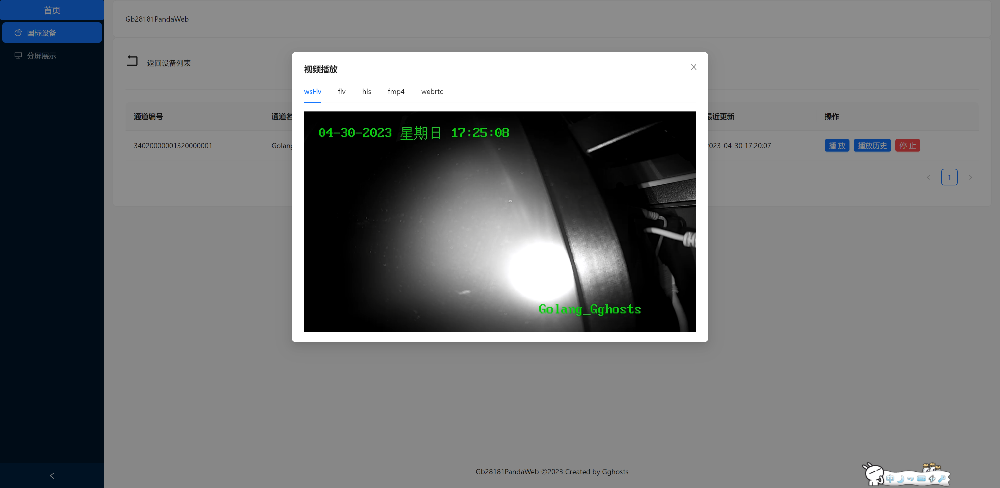
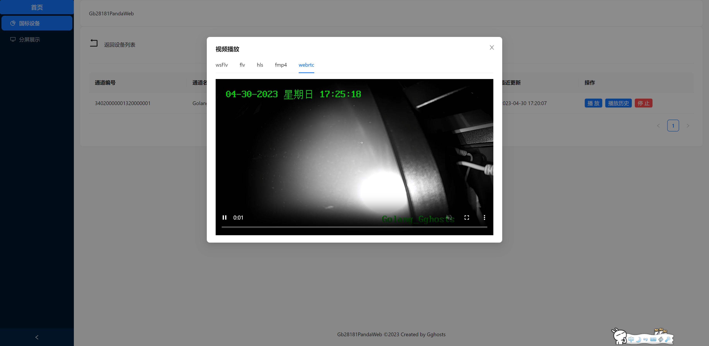
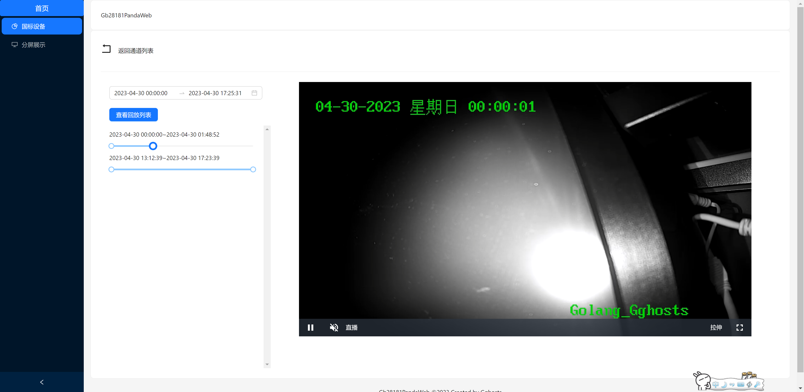
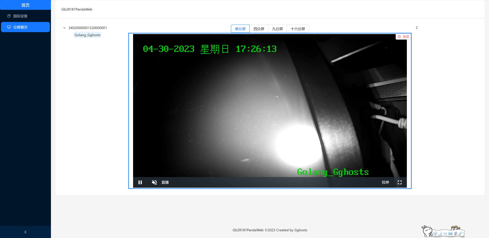
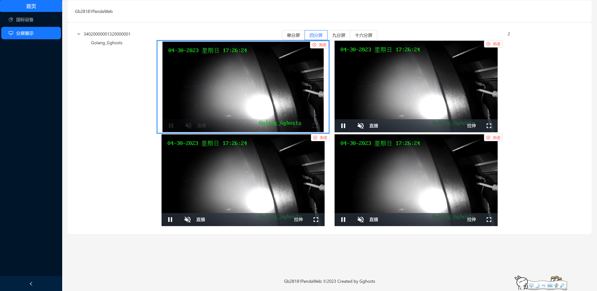
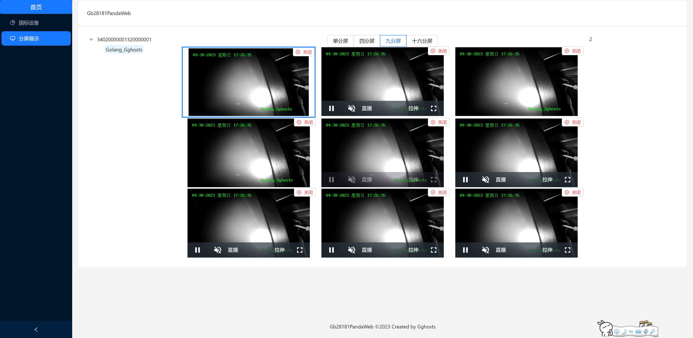
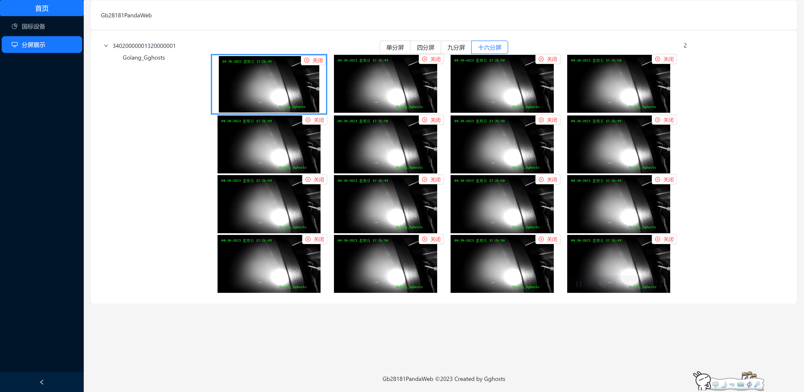
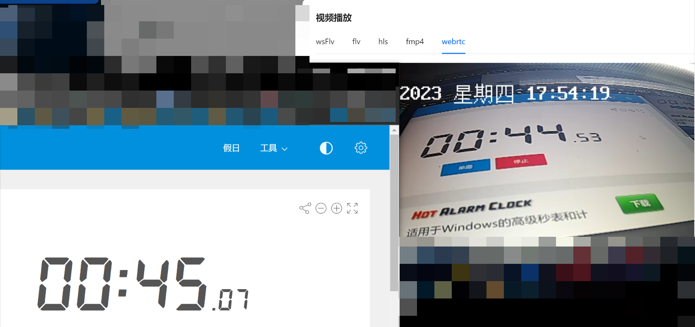
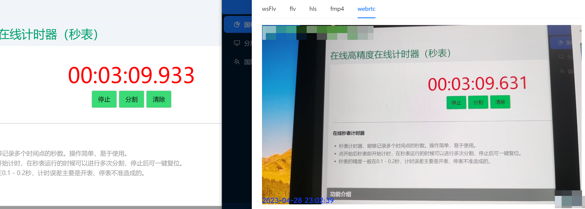

## 🐼项目描述

- GB28181服务
- 信令sip及路由采用go
- 流媒体采用夏楚大大的[ZLMediaKit](https://github.com/ZLMediaKit/ZLMediaKit)
- 流媒体播放地址支持:rtsp、rtmp、wsFlv、m3u8、http-flv、fmp4、ts等地址

## 🔨技术栈

- Golang
- Sip
- ZLMediaKit

## 🚂搭配的前端项目

[gb28181PandaWeb](https://github.com/pans0930/gb28181PandaWeb)

## 🕹️线上测试系统地址

```
http://1.117.28.81:9999/
```

- 通道播放
  
  
- 历史视屏回放
  
- 分屏展示效果
  
  
  
  

## 📺延迟效果

webrtc下大约在<=500ms左右，此情况根据不同的网络环境和服务器配置会有差距，延迟如下

- 摄像头webrtc延时如下
  
- 手机摄像头webrtc延时如下
  

## 📖已实现的功能

- [x] 下级设备的上报和通道上报
- [x] 下级设备的视频播放和视频停止
- [x] 下级级联设备的上报和通道的上报
- [x] 下级设备的视频播放和视频停止
- [x] 预警消息订阅
- [x] 历史视频的播放
- [x] ptz控制【无设备未测试】
- [x] 视频流传输模式：udp、tcp主动、tcp被动

## 📘TODO

- [ ] 国标级联
- [ ] 历史视频播放的seek操作-暂停、倍速、下载等
- [ ] 预警消息处理
- [ ] 位置订阅
- [ ] 上级级联播放本级视频
- [ ] 防止设备伪造请求，除了[Register],其他数据都要先查询来源【ip】和【port】在【t_device】中是否存在，存在放行数据，不存在直接丢弃

## 使用说明

- 相关配置项在config.yaml文件，请自行修改
- 数据库需导入sql文件夹下的2个sql文件

## 微信群


## 📄windows下的编译命令

```shell
$env:CGO_ENABLED="0"
$env:GOOS="linux"
$env:GOARCH="amd64"
go build -o gb28181Panda main.go
```

```shell
其余平台编译方式请自行查阅go的交叉编译
```
